# LiberandoProducto-RafaelTorices

Repository for the subject "Liberando Producto" of the Bootcamp DevOps of KeepCoding.

## Description

This repository contains the code for a sample application with **Python** and **FastAPI** with **MySQL** as database. The application is a simple CRUD of a students database. The application has counters metrics for the endpoints and a health endpoint that are collected by **Prometheus** and visualized in a **Grafana** dashboard.
The application is containerized with **Docker**, run local with **Docker Compose** and deployed in **Kubernetes** with **Helm**. The application has a **GitHub Actions** workflow to run the tests of the application and another workflow to create a release in GitHub and upload the Docker image to Docker Hub. The application has defined also metrics and alerts in a **Prometheus** and **Grafana** stack to monitoring the application.

## Requirements

- **Docker**
- **Docker Compose**
- **kubectl**
- **Helm**
- **minikube** or other Kubernetes cluster

## Repository structure

- **.github**: Contains the GitHub Actions workflows:

  - **release.yaml**: Create a release in GitHub when a tag is pushed and upload the Docker image to Docker Hub.
  - **test.yaml**: Run the tests of the application when a push is made to the repository or a pull request is made.

- **helm**: Contains the Helm chart for the application.

- **monitoring**: Contains the Prometheus and Grafana configuration files:
  
    - **dashboard.json**: JSON file with the dashboard for Grafana with the metrics of the application.
    - **values.yaml**: Values file for Prometheus and Grafana, with the configuration of the data sources, alerts, configuration for slack notifications, etc.

- **src**: Contains the source code of the application:

  - **application**: Contains the code of the python application.
  - **config**: Contains the configuration files for the database application.
  - **tests**: Contains the tests of the application.
  - **tools**: Contains the scripts for the GitHub Actions workflows (check that MySQL is running).

- **docker-compose.env**: Environment variables for the docker-compose file.

- **docker-compose.yaml**: Docker compose file to run the application locally.

- **Dockerfile**: Dockerfile to build the Docker image of the application.

- **README.md**: This file.

- **requirements.txt**: Python requirements install file.

## How to run the application locally

To run the application locally, you need to have installed **Docker** and **Docker Compose** and run the following command:

```
  docker-compose up -d
```

This command will run the **Python application** in the port _**8000**_ and **FastApi** in the port _**8082**_ and the database **MySQL** in the port _**3306**_.

To access the Python application, you can use the following:

```
  http://localhost:8000

  curl -X 'GET' \
      'http://0.0.0.0:8000/' \
      -H 'accept: application/json'
```

Response:

```
  {"message":"Hello World"}
```

To check the Python application is healthy, you can use the following URL:

```
  http://localhost:8000/health

  curl -X 'GET' \
      'http://0.0.0.0:8000/health'/' \
      -H 'accept: application/json'
```

Response:

```
  {"message":"The application is healthy"}
```

To access the FastApi application, you can use the following URL:

```
  http://localhost:8082/docs
```

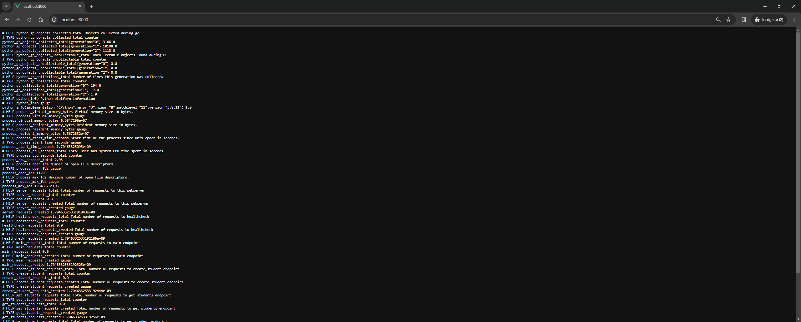

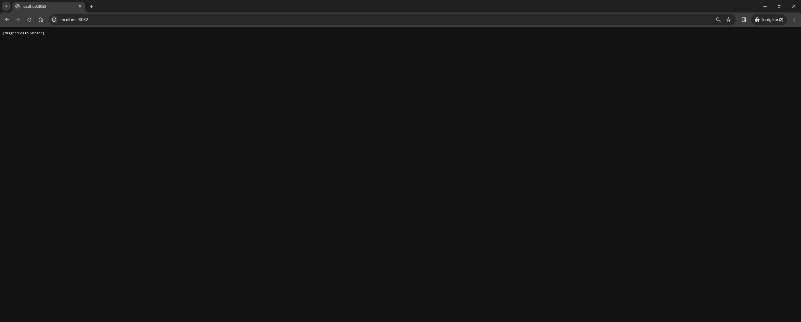

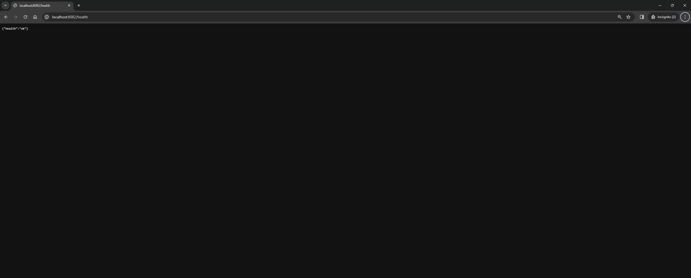

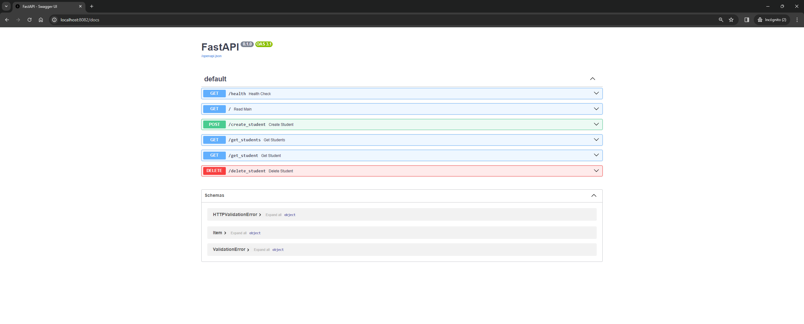


Run the following command to stop the application:

```
  docker-compose down
```

## How to run the application in Kubernetes

To run the application in Kubernetes, you need to have installed **kubectl** and **Helm** and run the following commands:

```
  cd helm
  helm -n python-app-fastapi upgrade demo --wait --install --create-namespace python-app-fastapi
```

This command will run the **Python application** in the port _**8000**_ and **FastApi** in the port _**8082**_ and the database **MySQL** in the port _**3306**_.

To access the Python application, you can use the following command:

```
  kubectl -n python-app-fastapi port-forward svc/demo-python-app-fastapi-service 8000:8000
```

To check the Python application is healthy, you can use the following command:

```
  curl http://localhost:8000/health
```

To access the FastApi application, you can use the following command:

```
  kubectl -n python-app-fastapi port-forward svc/demo-python-app-fastapi-service 8082:8082
```

To access the FastApi application, you can use the following URL:

```
  http://localhost:8082/docs
```

To stop the application, you can run the following command:

```
  helm -n python-app-fastapi uninstall python-app-fastapi
```

## How to run monitoring

To run the monitoring, you need to have installed **kubectl** and **Helm** and run the following commands:

```
  helm repo add prometheus-community https://prometheus-community.github.io/helm-charts
  helm repo update
  helm -n monitoring upgrade \
    --install prometheus \
    prometheus-community/kube-prometheus-stack \
    -f monitoring/values.yaml \
    --create-namespace \
    --wait --version 55.4.0
```

This commands will run **Prometheus** in the port _**9090**_ and **Grafana** in the port _**3000**_.

To access the Prometheus application, you can use the following command:

```
  kubectl -n monitoring port-forward svc/prometheus-kube-prometheus-prometheus 9090:9090
```

To access the Grafana application, you can use the following command:

```
  kubectl -n monitoring port-forward svc/prometheus-grafana 3000:http-web
  http://localhost:3000
```
> ## Credentials for Grafana:
  >**User**: admin
  >
  >**Password**: prom-operator
  >

To stop the monitoring, you can run the following command:

```
  helm -n monitoring uninstall prometheus
```

## Endpoints of the application Python and FastApi

The application has the following endpoints:

- **GET /**: Home of the application.
- **GET /health**: Check the health of the application.
- **GET /get_students**: Get all the students.
- **GET /get_student/{id}**: Get a student by id.
- **POST /create_student**: Create a student.
- **DELETE /delete_student/{id}**: Delete a student by id.


## Testing and workflow GitHub Actions

The application has a GitHub Actions workflow to run the tests of the application when a push is made to the repository or a pull request is made. The workflow is defined in the file **.github/workflows/test.yaml**.

The workflow has the following steps:

- **Checkout**: Checkout the repository.
- **Run MySQL**: Run MySQL in a Docker container.
- **Check MySQL**: Check that MySQL is running.
- **Setup Python**: Setup Python in the workflow.
- **Install dependencies**: Install the dependencies of the application.
- **Run tests**: Run the tests of the application wih pytest and coverage.
- **Destroy MySQL**: Stop MySQL.

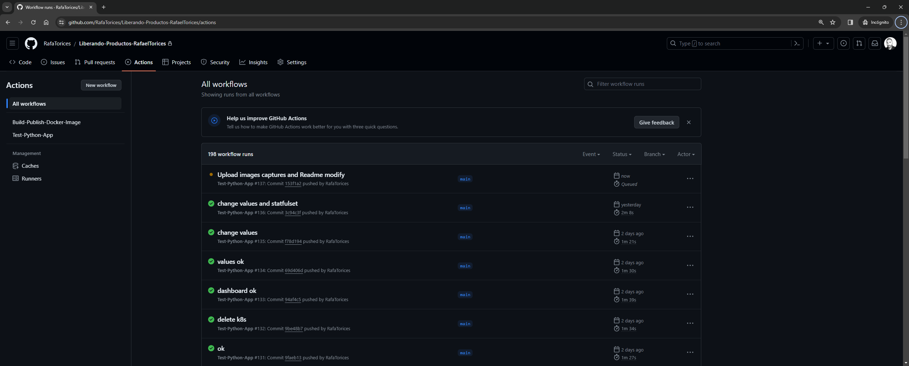

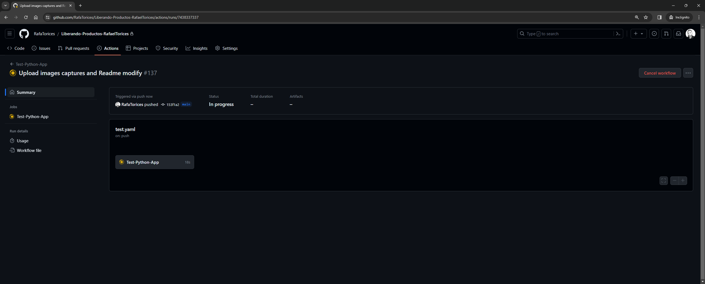

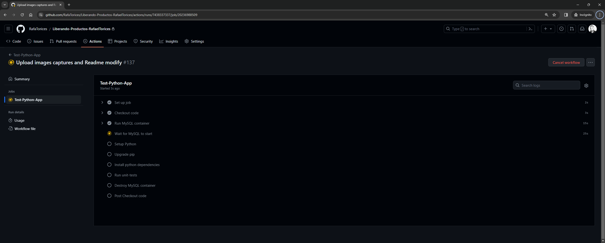

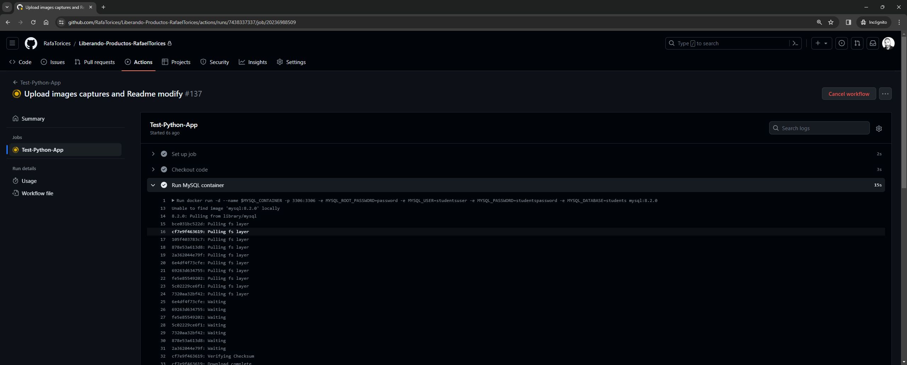

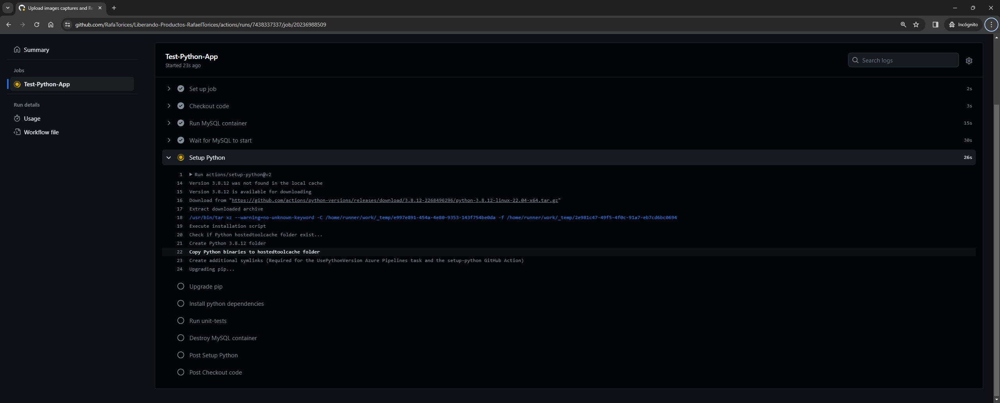

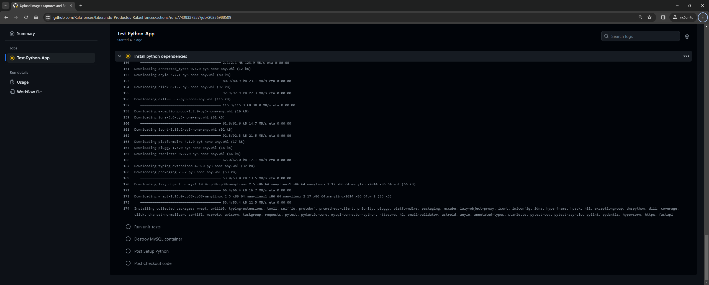

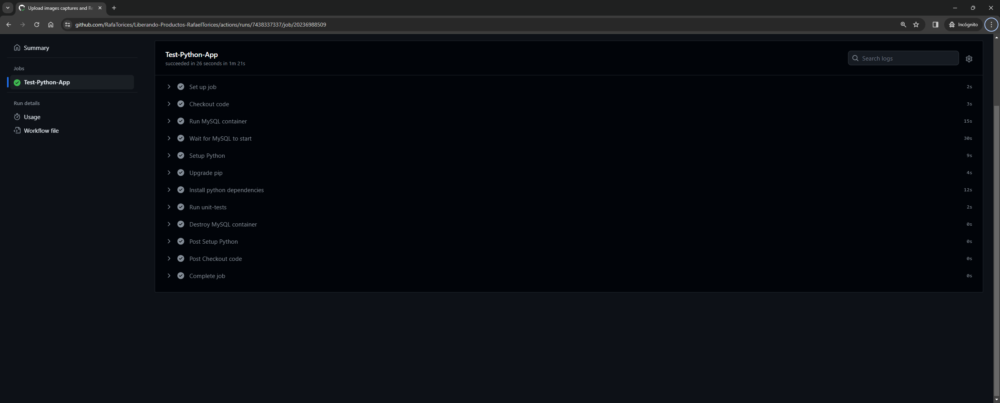


## Release and workflow GitHub Actions

The application has a GitHub Actions workflow to create a release in GitHub when a tag is pushed and upload the Docker image to Docker Hub. The workflow is defined in the file **.github/workflows/release.yaml**.

The workflow has the following steps:

- **Checkout**: Checkout the repository.
- **Login GitHub registry**: Login in GitHub registry.
- **Login Docker Hub**: Login in Docker Hub.
- **Create release**: Create a release in GitHub.
- **Build Docker image**: Build the Docker image of the application.
- **Push Docker image**: Push the Docker image to Docker Hub.

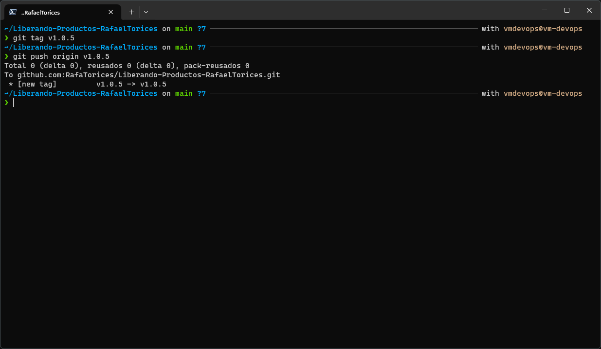

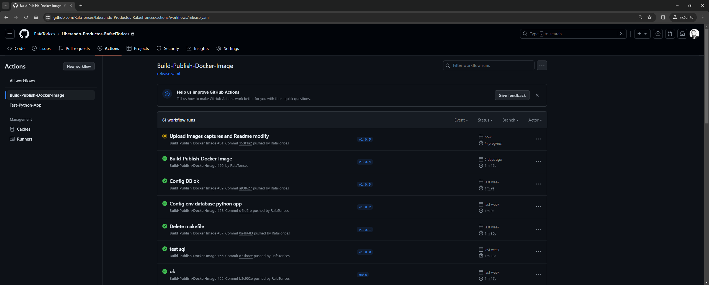

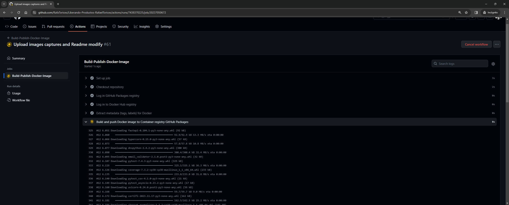

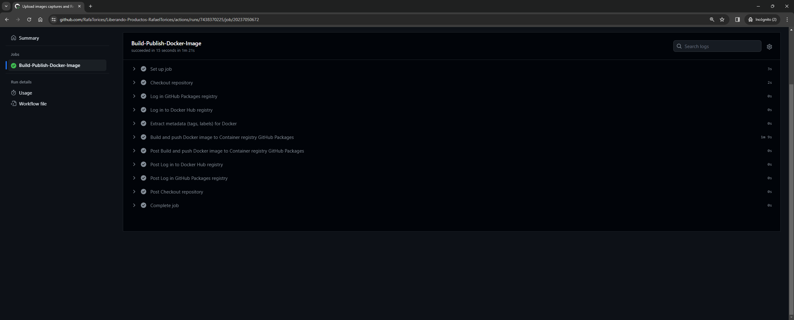

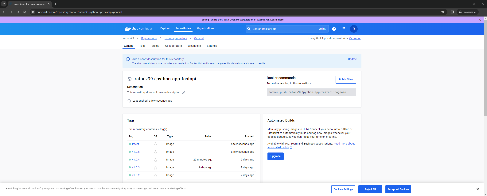


## Prometheus and Grafana

The application has a Prometheus and Grafana configuration files in the folder **monitoring**.

The alerts of the application are defined in the file **monitoring/values.yaml**:

> NOTE: the alerts are configured to send notifications to a Slack channel. To configure the notifications, you need to create a Slack app and configure the channel and the webhook in the file **monitoring/values.yaml**.
In this case, the Slack app is configured for slack channel: **#rafaeltorices-prometheus-alarms**.

- **Alerts added to the application**:

  - **PythonAppFastApiConsumingMemoryMoreThanRequest**: Alert when the Python application is consuming more memory than the request.
  - **PythonAppFastApiConsumingCPUMoreThanRequest**: Alert when the Python application is consuming more CPU than the request.
  - **PythonAppFastApiConsumingMemoryMoreThanRequestMySQL**: Alert when the MySQL application is consuming more memory than the request.

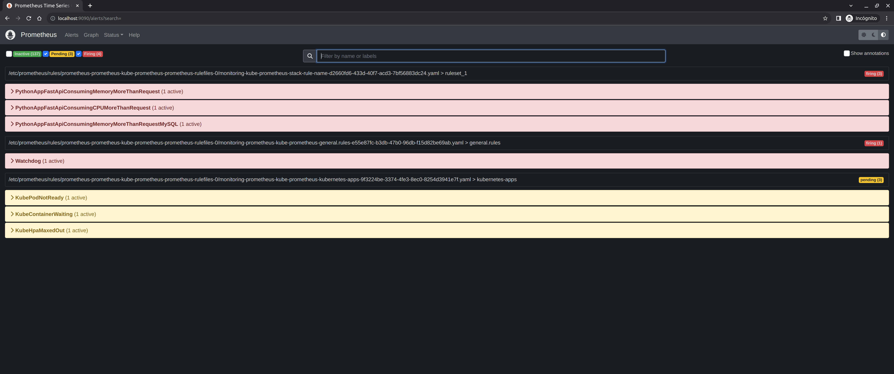

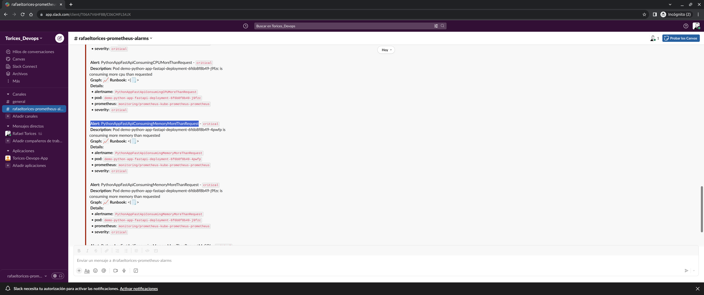

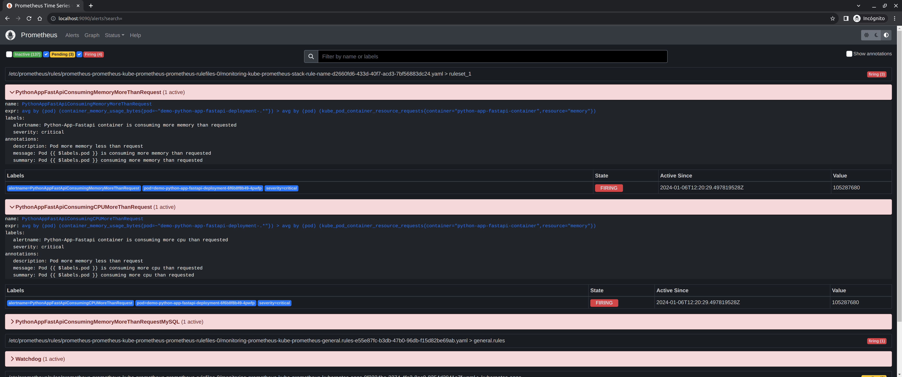

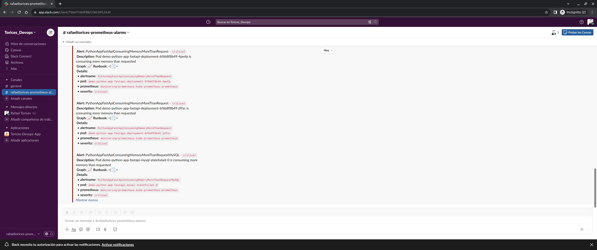

The dashboard of the application is defined in the file **monitoring/dashboard.json**.

This dashboard has the following panels:

- **Counter of requests app Python FastApi init**: Counter of requests of the application to the endpoint /health.
- **Counter of requests by endpoint**: Counter of requests of the application by endpoint: get_students, get_student, create_student, delete_student.
- **Metrics of the application**: Metrics of the application: like memory, CPU, etc.


> NOTE: for testing metrics, you can use the following command to generate requests to the application and generate stress in the **pod** of the application:


```
  while true; do curl http://localhost:8000/health; sleep 1; done

  or

  apk update && apk add git go
  git clone https://github.com/jaeg/NodeWrecker.git
  cd NodeWrecker  
  go build -o extress main.go
  ./extress -abuse-memory -escalate -max-duration 10000000
```

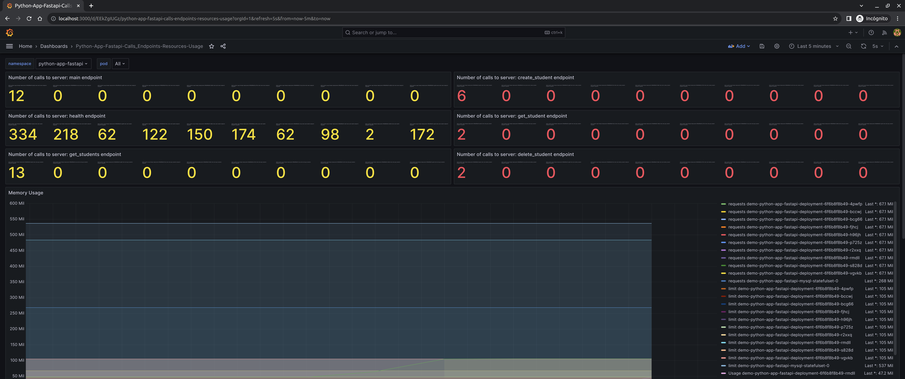

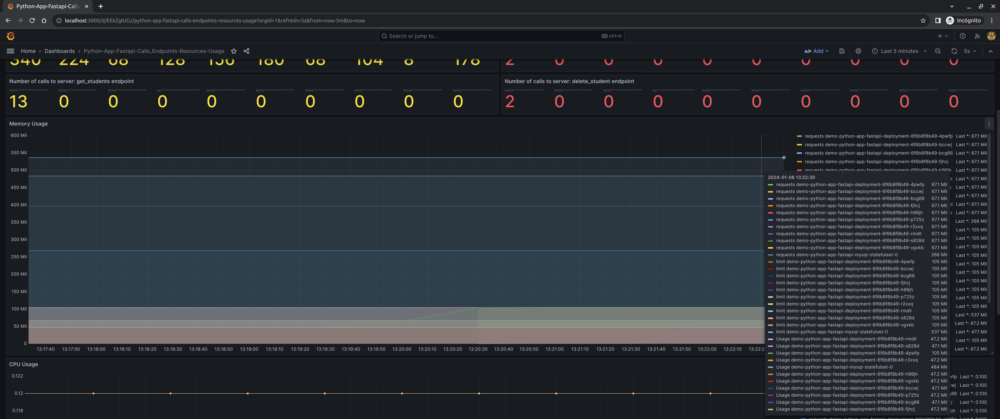

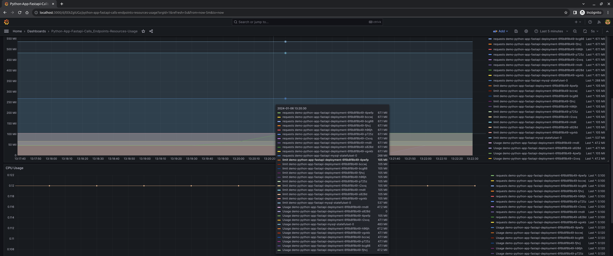

## Sources

- [FastAPI](https://fastapi.tiangolo.com/)
- [Docker](https://www.docker.com/)
- [Docker Compose](https://docs.docker.com/compose/)
- [Kubernetes](https://kubernetes.io/)
- [Helm](https://helm.sh/)
- [Prometheus](https://prometheus.io/)
- [Grafana](https://grafana.com/)
- [GitHub Actions](https://github.com/)
- [Python](https://www.python.org/)
- [MySQL](https://www.mysql.com/)
- [pytest](https://docs.pytest.org/en/6.2.x/)
- [coverage](https://coverage.readthedocs.io/en/coverage-5.5/)
- [miniKube](https://minikube.sigs.k8s.io/docs/)
- [Docker Hub](https://hub.docker.com/)

## Author

> RAFAEL TORICES
